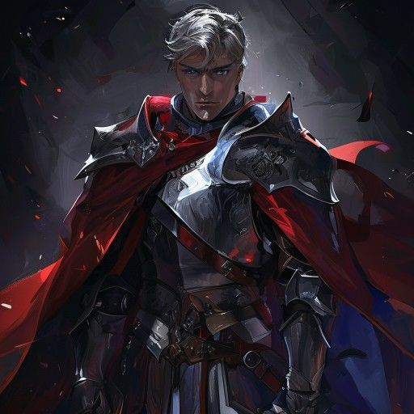
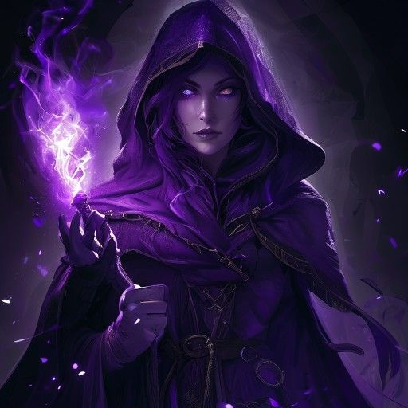
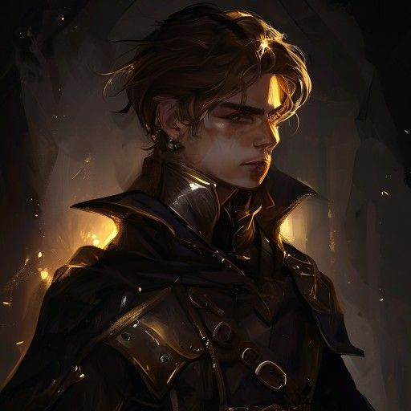

# Première Fantasie — L'Écho de la Brume

> Un RPG à l'ancienne inspiré de Final Fantasy IX, entièrement construit en vanilla JS + Three.js + Rust/WASM.

<p align="center">
  
  
  
  
</p>

---

## Gameplay

Un RPG tactique au tour par tour avec :

- **Combat ATB** (Active Time Battle) — jauge de temps réelle, pas de tour figé
- **4 héros jouables** avec classes, compétences et croissance uniques
- **Système de Jobs** — chaque personnage évolue dans un métier (Voleur, Chevalier, Magicienne Noire, Prêtresse)
- **Système de Mascottes** — compagnons combattants avec XP et capacités
- **Inventaire complet** — armes, armures, objets, équipement
- **Boutiques en ville** — acheter, vendre, gérer son gear
- **Dialogues narratifs** — histoire en chapitres, portraits de personnages
- **3 zones** — Ville de l'Amour, Forêt Sombre, Désert Aride, Town Machina

---

## Architecture Technique

```
first_fantasy/
├── index.html                 # Point d'entrée (ES modules, importmap Three.js)
├── css/styles.css             # 1000+ lignes CSS premium (glassmorphism, animations)
├── js/
│   ├── main.js                # Orchestrateur boot → title → field
│   ├── state.js               # État global (party, inventory, jobs, pets, flags)
│   ├── config.js              # Constantes (sizes, speeds, couleurs)
│   ├── data/                  # Données de jeu
│   │   ├── characters.js      # 4 héros (stats, growth, skills)
│   │   ├── enemies.js         # Bestiaire complet (3 monstres par zone)
│   │   ├── skills.js          # 20+ spells & capacités
│   │   ├── items.js           # Objets consommables + équipements
│   │   ├── jobs.js            # Système de métiers (Voleur, Mage, Chevalier...)
│   │   ├── pets.js            # Mascottes (stats, skills, evolution)
│   │   ├── story.js           # Narration par chapitres
│   │   └── banter.js          # Dialogues de combat (FFIX-style)
│   ├── engine/                # Systèmes cœur
│   │   ├── atb.js             # Moteur Active Time Battle (24kb)
│   │   ├── audio.js           # Audio manager (music, sfx, transitions)
│   │   ├── dialogue.js        # Système de dialogue typewriter
│   │   ├── inventory.js       # Inventaire & équipement
│   │   ├── progression.js     # Level-up, XP curves, stats growth
│   │   ├── field_map.js       # Génération de maps
│   │   ├── keyboard.js        # Input manager (keyboard + gamepad)
│   │   ├── save.js            # Save/Load (localStorage)
│   │   └── wasm_bridge.js     # Bridge JS ↔ WASM
│   ├── renderer/              # Rendu visuel
│   │   ├── canvas.js          # Canvas 2D (battles, HUD)
│   │   ├── effects.js         # Particles, flashes, screen shake (35kb)
│   │   ├── scenes.js          # Rendu de scènes (54kb)
│   │   ├── sprites.js         # Sprite sheets & animations (65kb)
│   │   ├── three_title.js     # Scene Three.js title (particules 3D)
│   │   ├── three_explore.js   # Scene Three.js exploration 3D
│   │   └── wasm_particles.js  # Particles GPU via WASM
│   ├── ui/                    # Interface
│   │   ├── battle_ui.js       # Battle HUD, command menus, ATB bars (65kb)
│   │   ├── menu.js            # Menu principal FFIX-style (23kb)
│   │   └── shop.js            # Système boutique (21kb)
│   └── scenes/                # Scènes de jeu
│       ├── title.js           # Title screen avec 3D
│       ├── field.js           # Exploration champêtre
│       ├── gameover.js        # Écran Game Over
│       └── theend.js          # Écran de fin
├── wasm_core/                 # Rust → WebAssembly
│   ├── src/lib.rs             # Calculs critiques (damage, particles, pathfinding)
│   ├── Cargo.toml
│   └── pkg/                   # Build output
├── sprites/                   # Art assets
│   ├── portraits/             # Portraits HD des héros & boss
│   ├── icons/                 # Icônes de skills & items
│   ├── heroes/                # Sprites de combat
│   └── enemies/               # Sprites d'ennemis
├── backgrounds/               # Arrière-plans de scènes (4 zones)
└── music/                     # Bande originale (16 pistes)
```

---

## Systèmes de Combat

### ATB (Active Time Battle)
Chaque personnage a une jauge de temps. Quand elle est pleine, le joueur choisit une action :
- **Attaque** — dégâts physiques directs
- **Skill** — capacité de classe (coûte MP)
- **Magic** — sorts élémentaires (Feu, Glace, Foudre, etc.)
- **Item** — objet consommable
- **Defendre** — réduit les dégâts reçus de 50%
- **Fuite** — tente de fuir le combat

### Banter System (FFIX-style)
Les personnages échangent des répliques pendant le combat — humoristiques, contextuelles, et uniques par combinaison de personnages.

---

## Personnages

| Portrait | Nom | Classe | Rôle |
|----------|-----|--------|------|
| 🗡 | **Luan** | Voleur | DPS agile — vole des objens, attaques rapides |
| 🛡 | **Sir Aldric** | Chevalier | Tank — couvre les alliés, brise les défenses |
| 🔮 | **Mira** | Magicienne Noire | DPS magique — feux, glaces, foudres |
| ✨ | **Selia** | Prêtresse | Healer — soins, buffs, résurrection |

---

## Zones

1. **Ville de l'Amour** — La cité natale. Marchands, quêtes initiales, tutorial
2. **Forêt Sombre** — Première zone hostile. Slimes, gobelins, le premier boss
3. **Désert Aride** — Territoire dangereux. Élémentaux, boss de mi-jeu
4. **Town Machina** — Cité steampunk. Boss final, résolution de l'intrigue

---

## Technologies

| Couche | Technologie |
|--------|-------------|
| Rendu 3D | Three.js (title screen, exploration) |
| Rendu 2D | Canvas API (combat, HUD, menus) |
| Calculs critiques | Rust → WebAssembly (damage calc, particles, pathfinding) |
| Audio | Web Audio API (OGG/MP3, crossfade, ducking) |
| UI | Vanilla DOM + CSS (glassmorphism, animations custom) |
| State | Vanilla JS (ES modules, no framework) |
| Sauvegarde | localStorage (JSON serialization) |

---

## Lancement

```bash
# Option 1 — Python
python server.py
# → http://localhost:8000

# Option 2 — Node
npx serve .

# Option 3 — Direct
# Ouvrir index.html dans un navigateur moderne
```

> ⚠️ Nécessite un serveur HTTP (modules ES). `file://` ne fonctionne pas.

---

## Build WASM (optionnel)

```bash
cd wasm_core
cargo install wasm-pack
wasm-pack build --target web --release
cp -r pkg/ ../wasm/
```

---

## Crédits

Un projet de **bahira** — RPG engine artisanal, ligne par ligne.

*Musique originale incluse — 16 pistes composées pour l'ambiance.*

---

## Roadmap

- [ ] CSS overhaul premium (animations AAA)
- [ ] Portraits intégrés au dialogue & menu
- [ ] Loading screen avec lore
- [ ] Système de recrutement de mascottes
- [ ] Quêtes secondaires
- [ ] Sauvegarde multi-slot
- [ ] Mode New Game+
- [ ] Combat en temps réel (optionnel)
